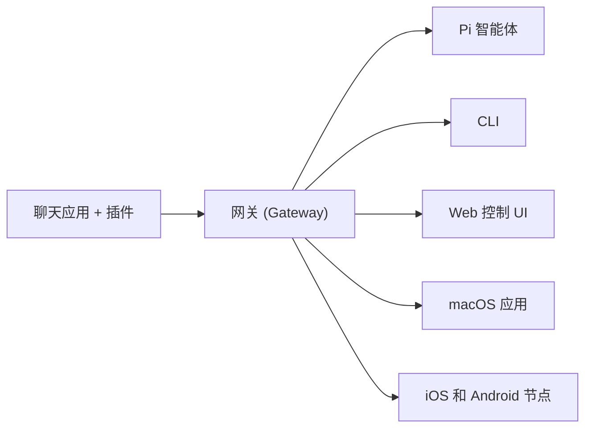

**[English](index.md)** | [简体中文]

---
summary: "OpenClaw 是一个跨操作系统的 AI 智能体多频道网关。"
read_when:
  - 向新人介绍 OpenClaw
title: "OpenClaw"
---

# OpenClaw 🦞

<p align="center">
    
    
</p>

> _"EXFOLIATE! EXFOLIATE!"_ — 大概是一只太空龙虾说的

<p align="center">
  <strong>适用于任何操作系统的 AI 智能体网关，横跨 WhatsApp, Telegram, Discord, iMessage 等平台。</strong><br />
  发送消息，即可从口袋里收到智能体的回复。插件还可支持 Mattermost 等更多平台。
</p>

<Columns>
  <Card title="快速开始" href="/start/getting-started" icon="rocket">
    几分钟内安装 OpenClaw 并启动网关。
  </Card>
  <Card title="运行向导" href="/start/wizard" icon="sparkles">
    通过 `openclaw onboard` 进行引导式设置和配对流程。
  </Card>
  <Card title="打开控制 UI" href="/web/control-ui" icon="layout-dashboard">
    启动浏览器仪表盘进行聊天、配置和会话管理。
  </Card>
</Columns>

## 什么是 OpenClaw?

OpenClaw 是一个 **自托管网关**，它将您喜爱的聊天应用 — WhatsApp, Telegram, Discord, iMessage 等 — 连接到像 Pi 这样的 AI 编程智能体。您在自己的机器（或服务器）上运行一个单一的网关进程，它就成为了您的消息应用和随时待命的 AI 助手之间的桥梁。

**它适合谁？** 适合那些希望拥有一个可以从任何地方发消息的个人 AI 助手，同时又不想放弃数据控制权或依赖托管服务的开发者和高级用户。

**它有什么不同？**

- **自托管**：在您的硬件上运行，由您制定规则
- **多频道**：一个网关同时服务于 WhatsApp, Telegram, Discord 等多个平台
- **智能体原生**：专为编程智能体打造，支持工具使用、会话、记忆和多智能体路由
- **开源**：MIT 许可证，社区驱动

**您需要什么？** Node 22+，一个 API 密钥（推荐 Anthropic），以及 5 分钟时间。

## 工作原理



网关是会话、路由和频道连接的单一事实来源。

## 关键能力

<Columns>
  <Card title="多频道网关" icon="network">
    通过单一网关进程支持 WhatsApp, Telegram, Discord 和 iMessage。
  </Card>
  <Card title="插件频道" icon="plug">
    通过扩展包添加 Mattermost 等更多支持。
  </Card>
  <Card title="多智能体路由" icon="route">
    按智能体、工作区或发送者隔离会话。
  </Card>
  <Card title="媒体支持" icon="image">
    发送和接收图片、音频和文档。
  </Card>
  <Card title="Web 控制 UI" icon="monitor">
    用于聊天、配置、会话和节点的浏览器仪表盘。
  </Card>
  <Card title="移动节点" icon="smartphone">
    配对支持 Canvas 的 iOS 和 Android 节点。
  </Card>
</Columns>

## 快速开始

<Steps>
  <Step title="安装 OpenClaw">
    ```bash
    npm install -g openclaw@latest
    ```
  </Step>
  <Step title="引导和安装服务">
    ```bash
    openclaw onboard --install-daemon
    ```
  </Step>
  <Step title="配对 WhatsApp 并启动网关">
    ```bash
    openclaw channels login
    openclaw gateway --port 18789
    ```
  </Step>
</Steps>

需要完整的安装和开发设置？请参阅 [快速开始](/start/quickstart)。

## 仪表盘

网关启动后打开浏览器控制 UI。

- 本地默认: [http://127.0.0.1:18789/](http://127.0.0.1:18789/)
- 远程访问: [Web 界面](/web) 和 [Tailscale](/gateway/tailscale)

<p align="center">
  
</p>

## 配置 (可选)

配置文件位于 `~/.openclaw/openclaw.json`。

- 如果您 **什么都不做**，OpenClaw 使用捆绑的 Pi 二进制文件以 RPC 模式运行，并使用按发送者隔离的会话。
- 如果您想加强控制，从 `channels.whatsapp.allowFrom` 和（对于群组）提及规则开始。

示例:

```json5
{
  channels: {
    whatsapp: {
      allowFrom: ["+15555550123"],
      groups: { "*": { requireMention: true } },
    },
  },
  messages: { groupChat: { mentionPatterns: ["@openclaw"] } },
}
```

## 从这里开始

<Columns>
  <Card title="文档中心" href="/start/hubs" icon="book-open">
    按用例组织的所有文档和指南。
  </Card>
  <Card title="配置" href="/gateway/configuration" icon="settings">
    核心网关设置、令牌和提供商配置。
  </Card>
  <Card title="远程访问" href="/gateway/remote" icon="globe">
    SSH 和 tailnet 访问模式。
  </Card>
  <Card title="频道" href="/channels/telegram" icon="message-square">
    WhatsApp, Telegram, Discord 等的特定频道设置。
  </Card>
  <Card title="节点" href="/nodes" icon="smartphone">
    支持配对和 Canvas 的 iOS 和 Android 节点。
  </Card>
  <Card title="帮助" href="/help" icon="life-buoy">
    常见修复和故障排除入口点。
  </Card>
</Columns>

## 了解更多

<Columns>
  <Card title="完整功能列表" href="/concepts/features" icon="list">
    完整的频道、路由和媒体能力。
  </Card>
  <Card title="多智能体路由" href="/concepts/multi-agent" icon="route">
    工作区隔离和按智能体划分的会话。
  </Card>
  <Card title="安全" href="/gateway/security" icon="shield">
    令牌、白名单和安全控制。
  </Card>
  <Card title="故障排除" href="/gateway/troubleshooting" icon="wrench">
    网关诊断和常见错误。
  </Card>
  <Card title="关于和致谢" href="/reference/credits" icon="info">
    项目起源、贡献者和许可证。
  </Card>
</Columns>
